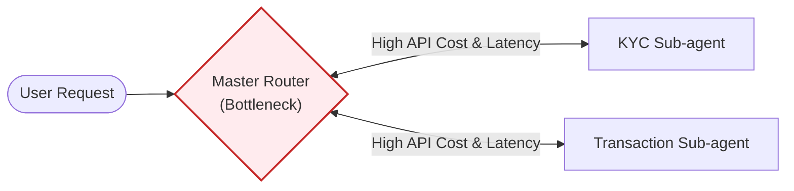
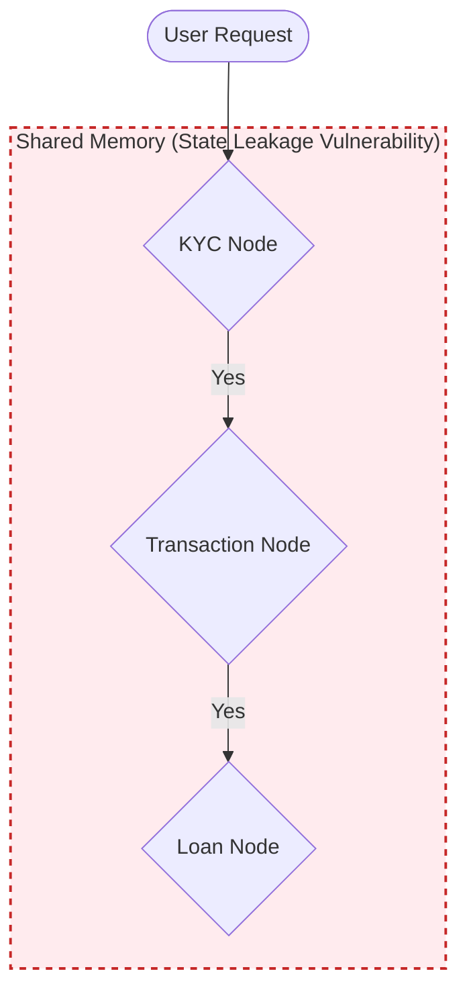
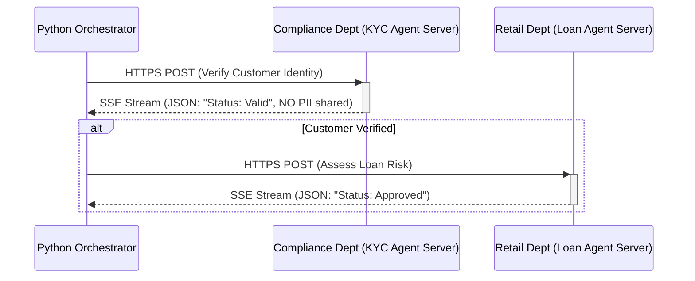

# Executive Architecture Strategy: Scaling Multi-Agent AI in Banking

**Target Audience:** VP/Director Level (Business, IT Strategy, Procurement)
**Author:** Chief Architecture Office
**Subject:** Vendor Procurement and Architectural Standards for Agentic AI

## 1. Executive Summary: The Decision

As our bank deploys networks of specialized AI agents (KYC, Loan Processing, Fraud), we face an architectural crossroads: buying single **"Monolithic"** AI platforms versus building an **"Agent-to-Agent" (A2A)** microservice network.

**The Directive:** The Agent-to-Agent (A2A) Protocol is our mandatory enterprise standard. We must procure and build agents as independent microservices that communicate securely over standardized network boundaries. Purchasing deeply coupled, monolithic AI platforms for cross-departmental orchestration is strictly prohibited.

**The Strategic Rationale:**
* **Performance Failure:** Our internal benchmarks prove monolithic platforms incur an "LLM Routing Tax," executing **63% slower** than decentralized A2A models. 
* **Security & Privacy Risk:** Monolithic agents share raw memory arrays, allowing a basic Marketing Agent to structurally access PII data meant only for a secure KYC Agent (State Leakage).
* **Vendor Lock-in:** Buying a monolithic AI platform means every future agent must be written in the exact same language and vendor framework. A2A enables technology-agnostic B2B integrations.

*(For the comprehensive technical deep-dive and benchmark proof justifying this summary, see **Section 2** below).*

---

## 2. Technical Deep Dive: Why The Monolith Fails

Vendor pitches often feature a "Master AI" orchestrating various sub-agents within a single platform (e.g., a massive Python LangGraph process). To validate this, we benchmarked the two main monolithic designs against the decentralized A2A Protocol.

### 2.1. Approach 1A: Sub-agents as Tools (LLM Orchestration)

The Master Orchestrator is a monolithic LLM that uses the sub-agents as callable tools via a ReAct loop.

* **The Problem (LLM Routing Tax):** *Extremely slow and expensive*. The centralized LLM must repeatedly query the Model API, pausing all operations, just to decide which tool/agent to invoke next. This latency compounds catastrophically at scale.

### 2.2. Approach 1B: Agent as Sub-graphs (Deterministic Node Routing)

The Master Orchestrator is a hardcoded state machine (`StateGraph`), and the sub-agents act as execution nodes within it. Routing is determined by code, not an LLM.

* **The Problem (State Leakage):** While faster than 1A, the monolithic nature means all node inputs and outputs share a unified `MasterState`. Deeply sensitive PII handled by the KYC node is structurally accessible to adjacent nodes within the single process, violating our strict data boundary and zero-trust requirements.

---

## 3. The Enterprise Standard: A2A Protocol (Agent Microservices)

To scale AI securely, treating agents as completely independent B2B/micro-services is non-negotiable. The A2A Protocol dictates that agents live on separate servers and communicate exclusively through secure, standardized network messages (JSON over HTTP/RPC).

### 3.1. Benchmarking the Three Approches
Our internal proof-of-concept tests yielded the following metrics, mathematically justifying the A2A mandate:

| Feature | 1A. Monolithic (LLM Router) | 1B. Monolithic (Hardcoded Graph) | 2. Decentralized (A2A Protocol) |
| :--- | :--- | :--- | :--- |
| **Execution Speed** | 🔴 Unacceptable (~130s) | 🟡 Acceptable (~117s) | 🟢 Optimal (~97s, concurrent async) |
| **Code Coupling** | 🔴 Tight (Same Python env) | 🔴 Tight (Same Python env) | 🟢 None (Language & Server agnostic) |
| **Security Risk** | 🔴 High (Prompt Injection) | 🔴 High (Shared Memory Leakage)| 🟢 Low (Cryptographic Network Boundaries) |

**Key Findings Summary:**
*   **The LLM Routing Tax:** The 1A Monolith was +34% slower because the Master LLM must continuously incur API round-trips to decide which tool to run next. A2A uses lightning-fast concurrent HTTP orchestrators.
*   **Monolithic Coupling:** Deploying agents via 1A/B physically binds all enterprise teams to the exact same Python LangGraph version. A2A allows the Fraud Team to use Rust while Retail uses Python.
*   **Prompt Injection Vulnerability:** In 1A/B, if a bad actor slips a malicious payload into a transaction document, that string sits inside the monolithic prompt window and can poison the Master LLM. A2A prevents this by only accepting strict, validated JSON artifacts back across the network.

---

## 4. The "Incubation to Marketplace" Lifecycle

While A2A is the ultimate enterprise destination, cross-departmental projects can actually **start** as temporary Monoliths to maximize agility. 

### Phase 1: Incubation (The Tiger Team Monolith)
When a central cross-functional team is rapidly prototyping a project, building a single LangGraph monolith (Approach 1B) is the fastest way to iterate on prompts without debating strict API schemas. Monoliths are excellent for finding initial product-market fit.

### Phase 2: Maturation (The A2A Marketplace Extraction)
The project *must* be physically extracted from the monolith and published as independent A2A microservices to the enterprise Agent Marketplace the moment any of these **Maturity Triggers** hit:
1. **The Reusability Trigger:** A second department (e.g., Credit Cards) wants to use your Loan app's KYC logic. It must become an A2A service to prevent code cloning.
2. **The Compliance Trigger:** Security mandates physical network separation between PII data access and the public-facing agent.
3. **The BAU Trigger:** The project transitions to Business-As-Usual maintenance. Different departments now require decoupled release cycles (KYC updates weekly, Loan updates quarterly).

---

## 5. Procurement & Deployment Directives: Use Case Mapping

As Directors budgeting and procuring AI solutions, strictly enforce the following framework to prevent catastrophic technical debt. Use the following **Use Case Mapping** to determine if a vendor's "Monolithic" pitch is acceptable, or if you must mandate "A2A Protocol" compliance.

### 5.1. The Architectural Decision Tree

Use this checklist to evaluate AI vendor pitches or internal funding requests. If you answer "Yes" to **any** of the A2A triggers, the A2A Protocol is mandatory.

| Decision Criteria | Yes | No |
| :--- | :--- | :--- |
| **1. Does the agent cross departmental/organizational boundaries?** | ➡️ **Mandate A2A** | Proceed |
| **2. Does the agent handle mixed data clearance levels (e.g., Public + PII)?** | ➡️ **Mandate A2A** | Proceed |
| **3. Does the initiative require 5+ independent specialized sub-agents?** | ➡️ **Mandate A2A** | Proceed |
| **4. Is the tool entirely internal, single-team, with uniform data access?** | ➡️ **Monolith Permitted** | Review Edge Cases |

### 5.2. Use Case Mapping Guide

| Business Use Case | Architectural Requirement | Rationale |
| :--- | :--- | :--- |
| **Internal HR Resume Parsing** | 🟡 **Monolith Permitted** | Single department ownership, identical data clearance layer, isolated execution. |
| **Internal Document Search (RAG)** | 🟡 **Monolith Permitted** | Single capability, no complex multi-team routing, safe to share state context internally. |
| **Retail Loan Origination** | 🟢 **A2A Mandatory** | Crosses departmental lines. Must securely interact with independent Compliance (KYC) and Core Banking services. |
| **Integrating 3rd-Party AI SaaS** | 🔵 **MCP Mandatory** | Vendors rarely provide pure autonomous "agents." They provide API tools. We must connect our internal agents to their platforms via the standard Model Context Protocol (MCP). |
| **Public Customer Support Chatbot** | 🟢 **A2A Mandatory** | The public-facing support agent must pull data from dozens of distinct, highly-secured back-office agents (Billing, Fraud) without risking PII exposure. |

### 5.3. The Hard Directives

**Directive 1: Departmental Capabilities (Monolith Permitted)**
If a team is paying for a specific tool *entirely within their own department* and *operating against the identical data clearance level*, single-platform monolithic agents are acceptable, provided they pass a security audit. 

**Directive 2: Cross-Functional Operations (A2A Mandatory)**
If an agent needs to communicate across departmental boundaries (e.g., Retail talking to Compliance), or if we are integrating a third-party vendor agent (e.g., Equifax, Bloomberg), **the A2A protocol is mandatory**. Do not buy or build monolithic platforms for cross-departmental orchestration.

**Directive 3: 3rd-Party Vendors and Data Access (MCP vs A2A)**
When connecting an internal agent to a 3rd-party SaaS vendor (e.g., Salesforce, Stripe) or our internal databases (e.g., SQL ledgers), mandate the **Model Context Protocol (MCP)**. 
It is exceedingly rare for a vendor to expose a fully autonomous agent that requires cross-agent A2A orchestration. Instead, vendors expose tools, APIs, and enterprise data which are structurally consumed via MCP servers.
*Rule of Thumb: Agents talk to other Agents via A2A. Agents talk to Software/Data via MCP.*

---
**Approval:** Chief Architecture Office
**Decision Status:** Mandatory Enforceable Standard
